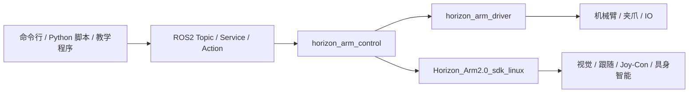
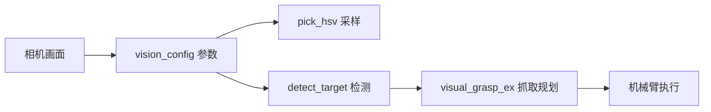

# Horizon Arm ROS2 2.0 核心功能教学开发指南

更新时间：2026-05-04

本文用于教学、演示、二次开发和现场联调。目标读者不需要先读源码，只要按步骤启动服务、调用接口、观察输出，就能理解 Horizon Arm ROS2 包每个核心功能怎么用、输入什么、输出什么、得到什么结果。

更完整的字段级接口定义见 [ROS2 SDK 开发接口说明](./05_ROS2_SDK开发接口.md)。现场部署和验收命令见 [部署说明](./部署说明.md)。

本文命令使用 `HORIZON_DELIVERY_ROOT`、`HORIZON_WS`、`HORIZON_SDK_ROOT`、`HORIZON_ARM_PORT`、`HORIZON_IO_PORT` 等变量。变量含义和设置方法见 [部署说明](./部署说明.md) 第 0 节；不同用户目录、不同串口时只需要改这些变量。

## 1. 总体理解

Horizon Arm ROS2 2.0 由两部分组成：

```text
${HORIZON_DELIVERY_ROOT}/
├── Horizon_Arm2.0_sdk_linux      # Linux SDK，提供底层能力和具身智能能力
└── horizon_arm_ws                # ROS2 工作空间，提供驱动、服务、话题、动作和文档
```

运行链路：



各包作用：

| 包名 | 作用 |
|---|---|
| `horizon_arm_driver` | 连接真实机械臂，发布关节状态，执行轨迹，使能、失能、急停、夹爪 |
| `horizon_arm_control` | 把 SDK 功能封装成 ROS2 service/action 和 Python SDK |
| `horizon_arm_interfaces` | 定义自定义 msg、srv、action |
| `horizon_arm_bringup` | 提供 launch 和一条命令验收入口 |
| `horizon_arm_description` | 机器人模型 |
| `horizon_arm_moveit_config` | MoveIt 和相关配置 |

## 2. 课前准备

进入工作空间：

```bash
cd "${HORIZON_WS}"
source /opt/ros/jazzy/setup.bash
source install/setup.bash
```

如果刚同步了代码，按下面方式编译。注意 `run_acceptance_check.py` 必须有执行权限，否则 `ros2 run` 会报 `No executable found`。

```bash
cd "${HORIZON_WS}"
chmod +x src/horizon_arm_bringup/scripts/run_acceptance_check.py

source /opt/ros/jazzy/setup.bash
colcon build --symlink-install --packages-select \
  horizon_arm_interfaces \
  horizon_arm_driver \
  horizon_arm_control \
  horizon_arm_bringup
source install/setup.bash

ros2 pkg executables horizon_arm_bringup
```

预期结果：

```text
horizon_arm_bringup run_acceptance_check.py
```

安装具身智能查询依赖：

```bash
python3 -m pip install aiohttp
```

如果 pip 被系统保护限制：

```bash
python3 -m pip install aiohttp --break-system-packages
```

## 3. 一条命令验收

验收的作用：自动启动服务栈，检查话题、服务、动作、SDK 导入、机械臂运动、夹爪、视觉 wrapper、跟随 wrapper、Joy-Con wrapper、示教 wrapper、具身 wrapper，并生成 HTML/JSON 报告。

无相机、无外部 IO 的实机验收：

```bash
ros2 run horizon_arm_bringup run_acceptance_check.py \
  --real-hardware \
  --sdk-root "${HORIZON_SDK_ROOT}" \
  --arm-port "${HORIZON_ARM_PORT}" \
  --io-port "${HORIZON_IO_PORT}" \
  --no-camera \
  --no-io \
  --step-delay-sec 3.0
```

参数含义：

| 参数 | 含义 |
|---|---|
| `--real-hardware` | 连接真实机械臂并执行真实动作 |
| `--sdk-root` | Linux SDK 根目录 |
| `--arm-port` | 机械臂串口，由 `HORIZON_ARM_PORT` 指定，常见值为 `/dev/ttyACM0` |
| `--io-port` | IO 串口，由 `HORIZON_IO_PORT` 指定，常见值为 `/dev/ttyUSB0` |
| `--no-camera` | 当前没有相机，跳过相机实采测试 |
| `--no-io` | 当前没有外部 IO，跳过真实 IO 输出 |
| `--step-delay-sec 3.0` | 每个真实动作后等待 3 秒，让机械臂稳定 |

预期结果：

```text
PASS=57 WARN=0 FAIL=0 SKIP=6
```

解释：

| 项 | 含义 |
|---|---|
| `PASS` | 本次实际检查通过 |
| `WARN` | 有提示但不阻塞 |
| `FAIL` | 阻塞问题，需要修复 |
| `SKIP` | 按参数或硬件条件跳过，不等于失败 |

报告位置：

```text
${HORIZON_WS}/horizon_full_acceptance/horizon_arm_system_check_results.html
${HORIZON_WS}/horizon_full_acceptance/horizon_arm_system_check_results.json
```

## 4. 启动完整服务栈

教学和二次开发时，通常先启动完整服务栈，再在另一个终端调用接口。

终端 1：

```bash
cd "${HORIZON_WS}"
source /opt/ros/jazzy/setup.bash
source install/setup.bash

ros2 launch horizon_arm_bringup sdk_real.launch.py \
  sdk_root:="${HORIZON_SDK_ROOT}" \
  arm_port:="${HORIZON_ARM_PORT}" \
  arm_baudrate:=115200 \
  io_port:="${HORIZON_IO_PORT}" \
  io_baudrate:=115200
```

启动后会出现这些服务节点：

| 节点 | 作用 |
|---|---|
| `horizon_arm_driver` | 连接机械臂并发布状态 |
| `horizon_arm_run_instruction_server` | 高层统一动作入口 |
| `horizon_arm_digital_output_server` | IO 输出 wrapper |
| `horizon_arm_visual_grasp_server` | 视觉抓取和检测 wrapper |
| `horizon_arm_follow_grasp_server` | 跟随 wrapper |
| `horizon_arm_joycon_server` | Joy-Con wrapper |
| `horizon_arm_teaching_server` | 示教 wrapper |
| `horizon_arm_embodied_server` | 具身智能 wrapper |

终端 2 检查接口：

```bash
ros2 topic list | grep horizon_arm
ros2 service list | grep horizon_arm
ros2 action list | grep horizon_arm
```

预期结果：能看到 `/horizon_arm/status`、`/horizon_arm/run_instruction`、`/horizon_arm/teach_jog` 等接口。

## 5. 状态读取教学

### 5.1 查看机械臂总状态

功能：判断硬件是否连接、电机是否使能、当前关节角和告警。

接口：`/horizon_arm/status`

输入：无，topic 订阅即可。

输出字段：

| 字段 | 含义 |
|---|---|
| `hardware_connected` | 是否连接机械臂硬件 |
| `motors_enabled` | 电机是否使能 |
| `joint_position_deg` | 6 轴角度，单位度 |
| `joint_velocity_deg_s` | 6 轴速度，单位度/秒 |
| `warnings` | 告警列表 |

命令：

```bash
ros2 topic echo /horizon_arm/status --once
```

预期结果：实机正常时 `hardware_connected: true`、`motors_enabled: true`，`joint_position_deg` 有 6 个数字。

### 5.2 查看关节状态

功能：读取当前关节位置，供二次开发程序做安全判断或记录示教点。

接口：`/horizon_arm/joint_states`

输出字段：

| 字段 | 含义 |
|---|---|
| `name` | 关节名 |
| `position` | 关节角，单位弧度 |
| `velocity` | 速度，单位弧度/秒 |

命令：

```bash
ros2 topic echo /horizon_arm/joint_states --once
```

预期结果：`name` 和 `position` 均包含 6 个元素。教学中如果要看角度，需要把弧度乘以 `57.2958`。

## 6. 基础运动教学

安全规则：

1. 先确认机械臂运动范围内无人、无遮挡。
2. 先做小角度运动，例如 5 度。
3. 每次真实动作后等待 3 秒。
4. 如果异常，立即调用急停。

### 6.1 使能机械臂

功能：让电机进入可控制状态。

接口：`/horizon_arm/enable`

输入：无。

输出：`success` 和 `message`。

命令：

```bash
ros2 service call /horizon_arm/enable std_srvs/srv/Trigger '{}'
```

预期结果：

```text
success: true
message: 机械臂电机已使能。
```

### 6.2 用高层指令做单轴小幅运动

功能：控制关节运动，使用角度单位，适合教学和脚本。

接口：`/horizon_arm/run_instruction`

输入：

| 字段 | 含义 |
|---|---|
| `instruction` | JSON 字符串，里面包含 `command`、`joints`、`duration` |
| `command` | `move_joints_deg` 表示按度数运动 |
| `joints` | 6 个目标关节角，单位度 |
| `duration` | 运动时长，单位秒 |

命令：

```bash
ros2 action send_goal /horizon_arm/run_instruction horizon_arm_interfaces/action/RunInstruction \
'{instruction: "{\"command\":\"move_joints_deg\",\"joints\":[0,5,0,0,0,0],\"duration\":2.0}"}'
sleep 3
```

预期结果：J2 移动到 5 度附近，Action 返回：

```text
success: true
message: move_joints_deg completed successfully
```

说明：驱动有 `execution_goal_tolerance_deg` 容差，默认约 3 度，因此实际角度可能不是完全等于目标角。

### 6.3 多轴小幅运动

功能：同时改变多个关节目标角。

命令：

```bash
ros2 action send_goal /horizon_arm/run_instruction horizon_arm_interfaces/action/RunInstruction \
'{instruction: "{\"command\":\"move_joints_deg\",\"joints\":[5,-5,0,0,0,0],\"duration\":2.0}"}'
sleep 3
```

预期结果：J1 接近 5 度，J2 接近 -5 度，返回 `success: true`。

### 6.4 回零位

功能：把 6 个关节目标角设为 0 度，便于演示结束。

命令：

```bash
ros2 action send_goal /horizon_arm/run_instruction horizon_arm_interfaces/action/RunInstruction \
'{instruction: "{\"command\":\"move_joints_deg\",\"joints\":[0,0,0,0,0,0],\"duration\":2.0}"}'
sleep 3
```

预期结果：机械臂回到接近 0 度的姿态。

### 6.5 急停

功能：异常时立即停止。

命令：

```bash
ros2 service call /horizon_arm/emergency_stop std_srvs/srv/Trigger '{}'
```

预期结果：返回 `success: true`。急停后先排查现场和硬件状态，不要立刻继续运动。

## 7. 预设动作教学

功能：执行 SDK 预设动作，例如“点头”。

预设文件：

```text
${HORIZON_SDK_ROOT}/config/embodied_config/preset_actions.json
```

输入：

| 输入 | 含义 |
|---|---|
| `preset:点头` | 在预设文件中查找名为“点头”的动作 |

命令：

```bash
ros2 action send_goal /horizon_arm/run_instruction horizon_arm_interfaces/action/RunInstruction \
'{instruction: "preset:点头"}'
sleep 3
```

预期结果：机械臂执行“点头”动作，返回：

```text
success: true
message: preset 点头 completed successfully
```

如果返回 `unknown preset`，说明预设名称不在配置文件里，或者 `preset_config_path` 没传对。

## 8. 夹爪教学

### 8.1 闭合夹爪

功能：夹爪抓取或闭合。

接口：`/horizon_arm/set_gripper_state`

输入：

| 字段 | 含义 |
|---|---|
| `open: false` | 闭合 |
| `current_ma: 1200` | 电流 1200 mA |

命令：

```bash
ros2 service call /horizon_arm/set_gripper_state horizon_arm_interfaces/srv/SetGripperState \
'{open: false, current_ma: 1200}'
sleep 3
```

预期结果：夹爪闭合，返回 `success: true`。

### 8.2 张开夹爪

输入：

| 字段 | 含义 |
|---|---|
| `open: true` | 张开 |
| `current_ma: 1200` | 电流 1200 mA |

命令：

```bash
ros2 service call /horizon_arm/set_gripper_state horizon_arm_interfaces/srv/SetGripperState \
'{open: true, current_ma: 1200}'
sleep 3
```

预期结果：夹爪张开，返回 `success: true`。

## 9. IO 教学

功能：控制外部 IO 数字输出，例如继电器、指示灯或外接设备。

接口：`/horizon_arm/set_digital_output`

输入：

| 字段 | 含义 |
|---|---|
| `channel` | 通道号，从 0 开始 |
| `state` | `true` 打开，`false` 关闭 |

打开第 0 路：

```bash
ros2 service call /horizon_arm/set_digital_output horizon_arm_interfaces/srv/SetDigitalOutput \
'{channel: 0, state: true}'
```

关闭第 0 路：

```bash
ros2 service call /horizon_arm/set_digital_output horizon_arm_interfaces/srv/SetDigitalOutput \
'{channel: 0, state: false}'
```

预期结果：有 IO 模块时对应输出变化并返回 `success: true`。没有 IO 模块时，验收请使用 `--no-io`，不要把真实 IO 输出作为通过项。

## 10. 视觉配置和检测教学

视觉能力不是一个单独的“能不能打开相机”检查，它是一条开发链路：



开发顺序建议：

1. 确认相机设备存在。
2. 确认标定文件和深度参数。
3. 用 `vision_config` 设置检测参数。
4. 用 `pick_hsv` 或 `detect_target` 验证目标识别。
5. 先用 `visual_grasp_ex dry_run` 看规划结果。
6. 最后才允许真实抓取。

相关配置：

| 配置 | 路径 | 作用 |
|---|---|---|
| 相机/手眼标定 | `${HORIZON_SDK_ROOT}/config/calibration_parameter.json` | 像素点到机械臂坐标转换 |
| 手眼标定姿态 | `${HORIZON_SDK_ROOT}/config/hand_eye_calibration_poses.yaml` | 标定过程记录 |
| 全局参数 | `${HORIZON_SDK_ROOT}/config/all_parameter_config.json` | SDK 通用参数 |

无相机时可以先学习配置接口和 dry-run；有相机后再做采样、检测和真实视觉任务。

### 10.1 设置 HSV 参数

功能：告诉视觉模块红色目标的 HSV 范围。

接口：`/horizon_arm/vision_config`

输入重点：

| 字段 | 含义 |
|---|---|
| `command: set` | 设置参数 |
| `pipeline: hsv` | 使用 HSV 检测 |
| `target_class: red_block` | 目标命名为红色方块 |
| `hsv_h_min/hsv_h_max` | 色相范围 |
| `hsv_s_min/hsv_s_max` | 饱和度范围 |
| `hsv_v_min/hsv_v_max` | 明度范围 |
| `depth_min_m/depth_max_m` | 深度过滤范围 |

命令：

```bash
ros2 service call /horizon_arm/vision_config horizon_arm_interfaces/srv/VisionConfig \
'{command: "set", pipeline: "hsv", target_class: "red_block", conf_thres: 0.5, iou_thres: 0.45, interval_sec: 0.2, hsv_h_min: 0, hsv_h_max: 12, hsv_s_min: 80, hsv_s_max: 255, hsv_v_min: 60, hsv_v_max: 255, depth_min_m: 0.08, depth_max_m: 0.8}'
```

预期结果：返回 `success: true`，`config_json` 中包含刚设置的 HSV 和深度参数。

### 10.2 查询视觉配置

命令：

```bash
ros2 service call /horizon_arm/vision_config horizon_arm_interfaces/srv/VisionConfig \
'{command: "get"}'
```

预期结果：返回当前视觉参数 JSON。

### 10.3 HSV 采样

功能：从相机画面指定像素点采 HSV，用于调参。

接口：`/horizon_arm/pick_hsv`

输入：

| 字段 | 含义 |
|---|---|
| `u/v` | 像素坐标 |
| `window_size` | 采样窗口 |
| `use_depth_filter` | 是否使用深度过滤 |

命令：

```bash
ros2 service call /horizon_arm/pick_hsv horizon_arm_interfaces/srv/PickHSV \
'{u: 320.0, v: 240.0, window_size: 9, use_depth_filter: true, depth_min_m: 0.08, depth_max_m: 0.8}'
```

预期结果：有相机时返回 `h/s/v` 和推荐阈值；无相机时终端可能提示无法打开 `/dev/video0`，这是硬件缺失，不代表 ROS2 接口不存在。

### 10.4 目标检测

功能：根据当前配置检测目标。

接口：`/horizon_arm/detect_target`

输入：

| 字段 | 含义 |
|---|---|
| `pipeline` | `hsv` 或 `yolo` |
| `target_class` | 目标类别 |
| `conf_thres` | 置信度阈值 |
| `use_hsv` | 是否用 HSV |
| `use_depth` | 是否读取深度 |

命令：

```bash
ros2 service call /horizon_arm/detect_target horizon_arm_interfaces/srv/DetectTarget \
'{pipeline: "hsv", target_class: "red_block", conf_thres: 0.5, use_hsv: true, use_depth: true, depth_min_m: 0.08, depth_max_m: 0.8}'
```

预期结果：检测到目标时 `count > 0`，`bboxes` 返回目标框，`centers` 返回中心点。

返回数组解释：

| 字段 | 结构 |
|---|---|
| `bboxes` | 展平数组，每 4 个数是一组 `[x1, y1, x2, y2]` |
| `centers` | 展平数组，每 2 个数是一组 `[u, v]` |
| `scores` | 每个目标的置信度 |
| `depths_m` | 每个目标中心深度，单位米 |

开发者可以把检测结果接到抓取接口，例如取第一个目标框中心或 bbox，传给 `/horizon_arm/visual_grasp_ex`。

## 11. 视觉抓取教学

视觉抓取有两种推荐开发方式：

| 方式 | 输入 | 适用场景 |
|---|---|---|
| 点击抓取 | `u/v` 像素点 | GUI 点击、网页点击、人工指定目标 |
| 框选抓取 | `x1/y1/x2/y2` bbox | 接 YOLO/HSV 检测框、人工框选 |

核心安全原则：先 `dry_run: true`，确认返回目标位置和姿态合理，再去掉 dry-run 执行真实动作。

### 11.1 增强视觉抓取 dry-run

功能：检查视觉抓取链路和输入参数，不让机械臂真实抓取。

接口：`/horizon_arm/visual_grasp_ex`

输入：

| 字段 | 含义 |
|---|---|
| `mode: click` | 点击点模式 |
| `pipeline: click` | 直接使用点击点 |
| `dry_run: true` | 只规划，不执行 |
| `use_click: true` | 使用 `u/v` |
| `use_depth: true` | 使用深度 |
| `u/v` | 图像点击坐标 |
| `approach_height_m` | 预抓取高度 |
| `grasp_depth_m` | 下探深度 |

命令：

```bash
ros2 service call /horizon_arm/visual_grasp_ex horizon_arm_interfaces/srv/VisualGraspEx \
'{mode: "click", pipeline: "click", dry_run: true, use_click: true, use_depth: true, u: 320.0, v: 240.0, approach_height_m: 0.08, grasp_depth_m: 0.02}'
```

预期结果：返回 `success: true`，`message` 类似 `visual grasp ex dry-run accepted: click`，`result_json` 包含本次请求参数。机械臂不会运动。

`result_json` 中重点看：

| 字段 | 含义 |
|---|---|
| `mode/pipeline` | 本次使用的模式 |
| `dry_run` | 应为 `true` |
| `u/v` 或 `x1/y1/x2/y2` | 输入目标 |
| `approach_height_m` | 接近高度 |
| `grasp_depth_m` | 下探深度 |

### 11.2 bbox 抓取 dry-run

如果目标来自检测框，使用 bbox 模式：

```bash
ros2 service call /horizon_arm/visual_grasp_ex horizon_arm_interfaces/srv/VisualGraspEx \
'{mode: "bbox", pipeline: "manual", dry_run: true, use_click: false, use_bbox: true, use_depth: true, x1: 240.0, y1: 160.0, x2: 360.0, y2: 280.0, approach_height_m: 0.08, grasp_depth_m: 0.02}'
```

预期结果：返回 dry-run accepted，机械臂不动。开发者可把 `detect_target` 返回的第一组 `bboxes` 填到这里。

### 11.3 基础视觉抓取 dry-run

接口：`/horizon_arm/visual_grasp`

命令：

```bash
ros2 service call /horizon_arm/visual_grasp horizon_arm_interfaces/srv/VisualGrasp \
'{dry_run: true, use_bbox: false, u: 320.0, v: 240.0}'
```

预期结果：返回视觉 wrapper 健康检查或 dry-run 成功消息。

### 11.4 从检测到抓取的 Python 开发示例

下面示例演示二次开发最常见链路：配置 HSV -> 检测目标 -> 用第一个 bbox 做抓取 dry-run。

```python
import json
import rclpy
from rclpy.node import Node
from horizon_arm_control import HorizonArmRosSdk

rclpy.init()
node = Node("vision_grasp_dev_demo")
arm = HorizonArmRosSdk(node)

try:
    arm.wait_until_ready(include_extended_wrappers=True)

    config = arm.configure_vision(
        command="set",
        pipeline="hsv",
        target_class="red_block",
        hsv=[0, 12, 80, 255, 60, 255],
        depth_min_m=0.08,
        depth_max_m=0.8,
    )
    print("config:", config.payload_json)

    detect = arm.detect_target(
        pipeline="hsv",
        target_class="red_block",
        use_hsv=True,
        use_depth=True,
        depth_min_m=0.08,
        depth_max_m=0.8,
    )
    payload = json.loads(detect.payload_json)
    print("detect:", payload)

    if payload["count"] > 0:
        bbox = payload["bboxes"][:4]
        grasp = arm.visual_grasp_ex(
            mode="bbox",
            pipeline="manual",
            bbox=bbox,
            use_depth=True,
            dry_run=True,
            approach_height_m=0.08,
            grasp_depth_m=0.02,
        )
        print("grasp dry-run:", grasp.payload_json)
finally:
    node.destroy_node()
    rclpy.shutdown()
```

真实抓取前，把 `dry_run=True` 改成 `False` 前必须确认：

- 相机标定正确。
- `detect_target` 的 bbox 稳定且目标正确。
- 抓取高度和下探深度不会碰撞桌面。
- 机械臂工作空间安全。

## 12. 跟随功能教学

跟随功能用于持续根据目标在画面中的位置调整机械臂。它和抓取不同：抓取是一次性动作，跟随是循环控制。

支持三类模式：

| 模式 | 输入 | 说明 |
|---|---|---|
| `manual` | 手动 bbox | 用户框选目标，系统跟踪该目标 |
| `hsv` | HSV 参数 | 按颜色检测并跟随 |
| `yolo` | 目标类别和模型 | 按模型检测目标并跟随 |

### 12.1 查询跟随状态

功能：确认跟随 wrapper 是否可用、当前是否正在运行。

接口：`/horizon_arm/follow_target`

命令：

```bash
ros2 service call /horizon_arm/follow_target horizon_arm_interfaces/srv/FollowTarget \
'{command: "status"}'
```

预期结果：`success: true`，`running: false`，`state_json` 中包含当前模式、目标类别和参数。

### 12.2 设置手动目标框

功能：告诉跟随模块要跟随图像中的哪个框。

输入：

| 字段 | 含义 |
|---|---|
| `command: set_target` | 设置目标 |
| `mode: manual` | 手动目标框 |
| `options_json` | 框坐标 JSON |

命令：

```bash
ros2 service call /horizon_arm/follow_target horizon_arm_interfaces/srv/FollowTarget \
'{command: "set_target", mode: "manual", pipeline: "manual", options_json: "{\"x1\":240,\"y1\":160,\"x2\":360,\"y2\":280}"}'
```

预期结果：`state_json` 中 `manual_target_ready` 为 `true`。有相机、有安全空间后才调用 `start`。

### 12.3 启动和停止手动跟随

启动：

```bash
ros2 service call /horizon_arm/follow_target horizon_arm_interfaces/srv/FollowTarget \
'{command: "start", mode: "manual", pipeline: "manual", interval_sec: 0.1, deadband_px: 20.0, use_depth: true}'
```

停止：

```bash
ros2 service call /horizon_arm/follow_target horizon_arm_interfaces/srv/FollowTarget \
'{command: "stop"}'
```

预期结果：启动后 `running: true`，停止后 `running: false`。首次测试建议把速度参数保持为 0，让 SDK 默认限制生效。

### 12.4 HSV 跟随开发例子

先设置 HSV 范围：

```bash
ros2 service call /horizon_arm/follow_target horizon_arm_interfaces/srv/FollowTarget \
'{command: "start", mode: "hsv", pipeline: "hsv", target_class: "red_block", conf_thres: 0.5, interval_sec: 0.1, deadband_px: 20.0, use_depth: true, options_json: "{\"hsv_h_min\":0,\"hsv_h_max\":12,\"hsv_s_min\":80,\"hsv_s_max\":255,\"hsv_v_min\":60,\"hsv_v_max\":255}"}'
```

预期结果：有相机且颜色阈值正确时，系统会跟随红色目标。停止命令仍然使用：

```bash
ros2 service call /horizon_arm/follow_target horizon_arm_interfaces/srv/FollowTarget \
'{command: "stop"}'
```

### 12.5 基础跟随 wrapper 状态

接口：`/horizon_arm/follow_grasp_control`

命令：

```bash
ros2 service call /horizon_arm/follow_grasp_control horizon_arm_interfaces/srv/FollowGraspControl \
'{command: "status"}'
```

预期结果：返回 `success: true` 和 `running` 状态。

## 13. Joy-Con 教学

Joy-Con 功能用于通过蓝牙手柄控制机械臂。它不是只有状态查询，开发者可以通过 ROS2 服务做连接、启动、停止、模式切换、速度配置、姿态模式配置、输入状态读取。

使用前提：

| 条件 | 说明 |
|---|---|
| 蓝牙配对 | 左右 Joy-Con 已和 Ubuntu 主机配对 |
| 服务栈启动 | `joycon_server` 已启动 |
| 安全空间 | 手柄控制是实时人工控制，必须留出安全空间 |
| 低速测试 | 首次使用先低速、小范围移动 |

控制模式：

| 模式 | 说明 |
|---|---|
| `joint` | 手柄输入映射到关节角，适合新手理解 |
| `cartesian` | 手柄输入映射到末端位置和姿态，适合熟练操作 |
| `attitude` | 使用 IMU 控制末端姿态，适合直觉式姿态控制 |

### 13.1 基础状态查询

接口：`/horizon_arm/joycon_control`

输入：

| 字段 | 含义 |
|---|---|
| `command: status` | 查询基础状态 |

命令：

```bash
ros2 service call /horizon_arm/joycon_control horizon_arm_interfaces/srv/JoyconControl \
'{command: "status"}'
```

预期结果：返回 `success: true`，`running` 表示控制是否正在运行。

### 13.2 连接、启动、停止

连接手柄：

```bash
ros2 service call /horizon_arm/joycon_control horizon_arm_interfaces/srv/JoyconControl \
'{command: "connect"}'
```

启动控制：

```bash
ros2 service call /horizon_arm/joycon_control horizon_arm_interfaces/srv/JoyconControl \
'{command: "start"}'
```

停止控制：

```bash
ros2 service call /horizon_arm/joycon_control horizon_arm_interfaces/srv/JoyconControl \
'{command: "stop"}'
```

预期结果：连接成功时 `success: true`；启动后 `running: true`；停止后 `running: false`。

### 13.3 高级状态查询

接口：`/horizon_arm/joycon_advanced_control`

命令：

```bash
ros2 service call /horizon_arm/joycon_advanced_control horizon_arm_interfaces/srv/JoyconAdvancedControl \
'{command: "status"}'
```

预期结果：返回 `status_json` 和 `input_json`，可查看控制模式、速度档位和手柄输入状态。

### 13.4 切换到关节模式

输入：

| 字段 | 含义 |
|---|---|
| `command: set_mode` | 设置控制模式 |
| `mode: joint` | 使用关节模式 |

命令：

```bash
ros2 service call /horizon_arm/joycon_advanced_control horizon_arm_interfaces/srv/JoyconAdvancedControl \
'{command: "set_mode", mode: "joint"}'
```

预期结果：返回 `success: true`，状态中模式变为关节控制。

### 13.5 切换到笛卡尔模式

```bash
ros2 service call /horizon_arm/joycon_advanced_control horizon_arm_interfaces/srv/JoyconAdvancedControl \
'{command: "set_mode", mode: "cartesian"}'
```

预期结果：状态中模式变为笛卡尔控制。

### 13.6 配置速度档位

输入：

| 字段 | 含义 |
|---|---|
| `command: configure_speed` | 配置速度档位 |
| `speed_levels` | 速度倍率数组 |
| `speed_index` | 当前使用的档位 |

命令：

```bash
ros2 service call /horizon_arm/joycon_advanced_control horizon_arm_interfaces/srv/JoyconAdvancedControl \
'{command: "configure_speed", speed_levels: [0.2, 0.5, 1.0], speed_index: 0}'
```

预期结果：速度档位配置成功，首次建议 `speed_index: 0`。

### 13.7 配置关节控制参数

```bash
ros2 service call /horizon_arm/joycon_advanced_control horizon_arm_interfaces/srv/JoyconAdvancedControl \
'{command: "configure_joint", joint_angle_step: 2.0, joint_max_speed: 30, joint_acceleration: 50, joint_deceleration: 50}'
```

参数含义：

| 字段 | 含义 |
|---|---|
| `joint_angle_step` | 每次输入对应的关节角度步长，单位度 |
| `joint_max_speed` | 关节最大速度 |
| `joint_acceleration` | 加速度 |
| `joint_deceleration` | 减速度 |

### 13.8 配置笛卡尔控制参数

```bash
ros2 service call /horizon_arm/joycon_advanced_control horizon_arm_interfaces/srv/JoyconAdvancedControl \
'{command: "configure_cartesian", cartesian_position_step: 5.0, cartesian_rotation_step: 3.0, cartesian_max_speed: 50.0, cartesian_max_angular_speed: 30.0}'
```

参数含义：

| 字段 | 含义 |
|---|---|
| `cartesian_position_step` | 末端平移步长，通常按 mm 理解 |
| `cartesian_rotation_step` | 末端旋转步长，通常按度理解 |
| `cartesian_max_speed` | 最大线速度 |
| `cartesian_max_angular_speed` | 最大角速度 |

### 13.9 工作空间限制

```bash
ros2 service call /horizon_arm/joycon_advanced_control horizon_arm_interfaces/srv/JoyconAdvancedControl \
'{command: "configure_workspace", workspace_min_radius: 120.0, workspace_max_radius: 450.0, workspace_min_z: 50.0, workspace_max_z: 450.0}'
```

用途：限制手柄控制范围，减少误操作风险。首次开发建议设置保守范围。

### 13.10 姿态模式

启用姿态模式：

```bash
ros2 service call /horizon_arm/joycon_advanced_control horizon_arm_interfaces/srv/JoyconAdvancedControl \
'{command: "enable_attitude", attitude_mode: "joint"}'
```

关闭姿态模式：

```bash
ros2 service call /horizon_arm/joycon_advanced_control horizon_arm_interfaces/srv/JoyconAdvancedControl \
'{command: "disable_attitude"}'
```

预期结果：启用后 `attitude_mode` 字段变化，IMU 输入参与控制；关闭后回到基础控制。

### 13.11 读取手柄输入状态

```bash
ros2 service call /horizon_arm/joycon_advanced_control horizon_arm_interfaces/srv/JoyconAdvancedControl \
'{command: "input_status"}'
```

预期结果：`input_json` 返回摇杆、按键或 IMU 输入状态。开发 UI 时可以周期性调用该接口显示手柄输入。

### 13.12 Joy-Con Python 开发示例

```python
import json
import rclpy
from rclpy.node import Node
from horizon_arm_control import HorizonArmRosSdk

rclpy.init()
node = Node("joycon_dev_demo")
arm = HorizonArmRosSdk(node)

try:
    arm.wait_until_ready(include_extended_wrappers=True)

    print("status:", arm.joycon_advanced("status").payload_json)
    print("set mode:", arm.joycon_advanced("set_mode", mode="joint").message)
    print("speed:", arm.joycon_advanced(
        "configure_speed",
        speed_levels=[0.2, 0.5, 1.0],
        speed_index=0,
    ).payload_json)
    print("input:", arm.joycon_advanced("input_status").payload_json)
finally:
    node.destroy_node()
    rclpy.shutdown()
```

开发注意：

- 手柄实时控制不适合无人值守。
- UI 必须提供停止和急停按钮。
- 首次只读 `status/input_status`，确认蓝牙和输入正常后再 `start`。
- 模式切换、速度配置、工作空间限制应在启动控制前完成。

## 14. 示教功能教学

示教接口建议先用 `dry_run: true`，确认目标角度和轨迹合理，再执行真实运动。

### 14.1 关节点动 dry-run

功能：规划某个关节的增量运动，但不实际执行。

接口：`/horizon_arm/teach_jog`

输入：

| 字段 | 含义 |
|---|---|
| `command: joint_jog` | 关节增量点动 |
| `joint_index: 2` | 第 2 轴 |
| `delta: 5.0` | 增加 5 度 |
| `dry_run: true` | 只规划 |

命令：

```bash
ros2 service call /horizon_arm/teach_jog horizon_arm_interfaces/srv/TeachJog \
'{command: "joint_jog", joint_index: 2, delta: 5.0, interpolation_type: "joint", dry_run: true}'
```

预期结果：返回 `target_joint_angles`，机械臂不动。

### 14.2 基坐标平移 dry-run

功能：计算 TCP 在基坐标 X 方向平移 10 mm 后的关节角。

命令：

```bash
ros2 service call /horizon_arm/teach_jog horizon_arm_interfaces/srv/TeachJog \
'{command: "base_translate", frame: "base", axis: "x", delta: 10.0, interpolation_type: "cartesian", linear_velocity: 150.0, angular_velocity: 90.0, dry_run: true}'
```

预期结果：`detail_json` 包含：

| 字段 | 含义 |
|---|---|
| `current_pose` | 当前 TCP 位姿 |
| `target_pose` | 平移后的目标位姿 |
| `target_joint_angles` | 逆解得到的目标关节角 |

### 14.3 示教程序校验

功能：校验一个程序 JSON 是否能被解析为关节点，不执行运动。

接口：`/horizon_arm/teaching_program`

输入：

| 字段 | 含义 |
|---|---|
| `command: validate` | 校验程序 |
| `dry_run: true` | 只校验 |
| `program_json` | 程序内容 |

命令：

```bash
ros2 action send_goal /horizon_arm/teaching_program horizon_arm_interfaces/action/TeachingProgram \
'{command: "validate", dry_run: true, program_json: "{\"name\":\"demo\",\"points\":[{\"joint_angles\":[0,0,0,0,0,0]}]}"}'
```

预期结果：

```text
success: true
message: program validated: 1 joint points
```

## 15. 具身智能教学

具身智能不是一个简单的健康检查接口，它是把“自然语言理解 -> 动作规划 -> 调用机械臂/夹爪/视觉能力”串起来的开发入口。ROS2 包对交付 SDK 中的 `EmbodiedSDK` 做了服务封装，开发者可以通过 ROS2 service 或 Python SDK 调用它。

具身智能链路如下：


开发时要分清三种层级：

| 层级 | 用途 | 是否需要 AI 配置 |
|---|---|---|
| 能力查询 | 查询支持哪些函数、动作，确认 wrapper 和 SDK 可用 | 不需要有效 API key |
| 自然语言规划 | 让模型把自然语言转成动作序列 | 需要 `aisdk_config.yaml` 中 provider API key |
| 动作执行 | 调用机械臂、夹爪、视觉、语音等真实能力 | 需要硬件、标定或对应 SDK 配置 |

AI 配置文件由 `HORIZON_SDK_ROOT` 指向：

```text
${HORIZON_SDK_ROOT}/config/aisdk_config.yaml
```

常用字段：

| 字段 | 含义 |
|---|---|
| `providers.alibaba.api_key` | 阿里云通义千问 API key |
| `providers.deepseek.api_key` | DeepSeek API key |
| `default_params.temperature` | 输出随机性，越低越稳定 |
| `request.timeout` | 请求超时时间 |
| `embodied_intelligence.prompt_language` | 提示词语言，当前可用 `zh` |

如果不想把 key 写入文件，可以在部署脚本中由环境变量或现场配置管理工具写入该 YAML。关键点是：执行 `run` 或 `stream` 前，所选 `provider` 必须有可用 key。

### 15.1 健康检查

接口：`/horizon_arm/embodied_instruction`

命令：

```bash
ros2 service call /horizon_arm/embodied_instruction horizon_arm_interfaces/srv/EmbodiedInstruction \
'{command: "health", stream: false}'
```

预期结果：返回 `success: true`，说明 wrapper 可用。

这个接口的 `health` 本质上会调用 `EmbodiedSDK.get_available_functions()`。它只能说明 wrapper 和 SDK 基础导入正常，不代表自然语言模型已经能联网调用。

### 15.2 查询可用函数并理解函数含义

接口：`/horizon_arm/embodied_command`

命令：

```bash
ros2 service call /horizon_arm/embodied_command horizon_arm_interfaces/srv/EmbodiedCommand \
'{command: "functions"}'
```

预期结果：`result_json` 中包含类似这些函数：

| 函数 | 输入语义 | 输出语义 | 用途 |
|---|---|---|---|
| `c_a_j` | 6 个关节目标角和可选持续时间 | 动作是否执行成功 | 让模型生成关节角控制，例如“第二个关节转到 5 度” |
| `c_c_g` | 夹爪动作，张开或闭合，可带重试次数 | 夹爪控制是否成功 | 抓取、松开、夹紧 |
| `e_p_a` | 预设动作名称和速度 | 预设动作是否完成 | 执行“点头”“挥手”等预设动作 |
| `t_s_a` | 文本提示词和语音音色 | 对话和播报是否成功 | 语言对话、语音播报 |
| `v_r_o` | 物体描述，如“红色方块” | 视觉定位和抓取规划是否成功 | 找物体、移动到物体上方 |
| `v_s_a` | 视觉分析提示词和音色 | 图像分析和播报是否成功 | 看图问答、视觉描述 |

开发者要利用具身智能时，不应该硬编码这些内部函数名去直接拼动作；推荐把业务需求写成清晰自然语言，让 `EmbodiedSDK` 选择函数。函数列表主要用于：

- 在 UI 中展示“系统能做什么”。
- 给调试工具判断 SDK 版本和能力是否完整。
- 给二次开发者理解自然语言最终会落到哪些底层能力。

### 15.3 查询可用动作

接口：`/horizon_arm/embodied_command`

命令：

```bash
ros2 service call /horizon_arm/embodied_command horizon_arm_interfaces/srv/EmbodiedCommand \
'{command: "actions"}'
```

预期结果：返回可用函数或动作列表。

### 15.4 执行自然语言任务

接口：`/horizon_arm/embodied_command`

输入字段：

| 字段 | 含义 |
|---|---|
| `command: "run"` | 同步执行自然语言任务 |
| `instruction` | 用户自然语言指令 |
| `provider` | AI 服务商，例如 `alibaba` 或 `deepseek`；为空则使用服务默认参数 |
| `model` | 模型名，例如 `qwen-turbo`；为空则使用服务默认参数 |
| `control_mode` | 控制模式，常用 `real_only`；也可传 SDK 支持的 `simulation_only`、`both` |
| `options_json` | 扩展参数 JSON，例如指定 `config_path` |

先做低风险任务示例：

```bash
ros2 service call /horizon_arm/embodied_command horizon_arm_interfaces/srv/EmbodiedCommand \
'{command: "run", instruction: "查询当前系统支持的机械臂能力，不要执行真实运动", provider: "alibaba", model: "qwen-turbo", control_mode: "real_only"}'
```

预期结果：

| 字段 | 说明 |
|---|---|
| `success` | `true` 表示自然语言任务完成 |
| `message` | 通常为 `embodied instruction completed` 或 SDK 返回说明 |
| `result_json` | SDK 规划和执行结果，通常包含成功状态、动作过程或错误信息 |

执行真实动作示例：

```bash
ros2 service call /horizon_arm/embodied_command horizon_arm_interfaces/srv/EmbodiedCommand \
'{command: "run", instruction: "让机械臂执行点头动作", provider: "alibaba", model: "qwen-turbo", control_mode: "real_only"}'
sleep 3
```

预期结果：模型理解“点头动作”，调用预设动作能力，机械臂执行动作并返回成功结果。执行前必须确认机械臂工作空间安全。

关节控制示例：

```bash
ros2 service call /horizon_arm/embodied_command horizon_arm_interfaces/srv/EmbodiedCommand \
'{command: "run", instruction: "将第二个关节小幅转到5度，其余关节保持0度", provider: "alibaba", model: "qwen-turbo", control_mode: "real_only"}'
sleep 3
```

预期结果：模型应选择关节控制函数，J2 做小幅运动。自然语言存在不确定性，所以首次开发建议使用非常明确的指令，并在旁边准备急停。

### 15.5 流式执行自然语言任务

接口：`/horizon_arm/embodied_command`

命令：

```bash
ros2 service call /horizon_arm/embodied_command horizon_arm_interfaces/srv/EmbodiedCommand \
'{command: "stream", instruction: "先张开夹爪，然后执行点头动作", stream: true, provider: "alibaba", model: "qwen-turbo", control_mode: "real_only"}'
```

预期结果：`result_json` 是事件列表，常见事件包括：

| 事件 | 含义 |
|---|---|
| `progress` | SDK 执行过程中的进度文字 |
| `completion` | 最终完成结果 |

说明：当前 ROS2 service 是一次请求一次响应，因此它会把流式回调收集成 JSON 返回；如果后续要做 UI 实时进度条，可以在 ROS2 层扩展 action 或 topic，把这些事件实时发布出去。

### 15.6 历史记录

查询历史：

```bash
ros2 service call /horizon_arm/embodied_command horizon_arm_interfaces/srv/EmbodiedCommand \
'{command: "history"}'
```

清空历史：

```bash
ros2 service call /horizon_arm/embodied_command horizon_arm_interfaces/srv/EmbodiedCommand \
'{command: "clear_history"}'
```

用途：

| 场景 | 说明 |
|---|---|
| 教学演示 | 展示之前执行过哪些自然语言任务 |
| 调试 | 对比指令和模型规划结果 |
| 新任务开始前 | 清空历史，避免上下文影响后续任务 |

### 15.7 具身智能急停

具身智能层有自己的全局急停标志，用于阻止自然语言任务继续执行。

触发急停：

```bash
ros2 service call /horizon_arm/embodied_command horizon_arm_interfaces/srv/EmbodiedCommand \
'{command: "emergency_stop"}'
```

设置急停标志：

```bash
ros2 service call /horizon_arm/embodied_command horizon_arm_interfaces/srv/EmbodiedCommand \
'{command: "set_emergency_stop"}'
```

清除急停标志：

```bash
ros2 service call /horizon_arm/embodied_command horizon_arm_interfaces/srv/EmbodiedCommand \
'{command: "clear_emergency_stop"}'
```

注意：这和底层 `/horizon_arm/emergency_stop` 都重要。真实异常时，优先调用底层急停：

```bash
ros2 service call /horizon_arm/emergency_stop std_srvs/srv/Trigger '{}'
```

### 15.8 Python 二次开发示例

用 ROS2 Python SDK 调具身智能：

```python
import json
import rclpy
from rclpy.node import Node
from horizon_arm_control import HorizonArmRosSdk

rclpy.init()
node = Node("embodied_dev_demo")
arm = HorizonArmRosSdk(node)

try:
    ready = arm.wait_until_ready(include_extended_wrappers=True)
    print("ready:", ready)

    funcs = arm.embodied_command("functions")
    print("functions:", json.loads(funcs.payload_json))

    result = arm.embodied_command(
        "run",
        instruction="让机械臂执行点头动作",
        provider="alibaba",
        model="qwen-turbo",
        control_mode="real_only",
        timeout_sec=60.0,
    )
    print("message:", result.message)
    print("result:", result.payload_json)
finally:
    node.destroy_node()
    rclpy.shutdown()
```

开发要点：

| 要点 | 说明 |
|---|---|
| 先调用 `functions` | 确认具身 SDK 可用，并记录当前能力 |
| 自然语言要明确 | 避免“随便动一下”这种模糊指令 |
| 首次只做小动作 | 例如点头、小角度关节运动、夹爪开合 |
| 真实动作后等待 | 每次动作后 `sleep 3` |
| UI 开发建议 | 把 `result_json` 展开显示，便于用户理解模型规划了什么 |

### 15.9 具身智能开发边界

| 能力 | 需要什么条件 |
|---|---|
| `functions/actions/history` | 只需要 SDK 可导入 |
| 文本自然语言控制 | 需要 `aisdk_config.yaml` 中 provider API key 可用 |
| 语音播报 | 需要 TTS provider 配置和音频输出环境 |
| 视觉识别物体 | 需要相机、标定、视觉配置 |
| 真实机械臂动作 | 需要实机连接、工作空间安全、底层驱动可用 |

这不是说没有 AI 配置就不写具身智能教程，而是开发时要分阶段验证：先查能力，再配 AI，再做低风险自然语言任务，最后接真实动作和视觉任务。

### 15.10 EmbodiedSDK 直接开发接口

如果开发者不想经过 ROS2 service，也可以在自己的 Python 程序中直接调用交付 SDK。直接调用适合做算法验证、后台任务和非 ROS 应用；ROS2 调用适合和机械臂驱动、话题、Action 统一管理。两种方式底层能力一致。

前提：运行程序前让 Python 能找到 SDK。推荐在启动脚本里设置：

```bash
export PYTHONPATH="${HORIZON_SDK_ROOT}:${PYTHONPATH}"
```

常用 SDK 方法：

| 方法 | 输入 | 输出 | 用途 |
|---|---|---|---|
| `EmbodiedSDK(...)` | `provider`、`model`、`control_mode`、`config_path` | SDK 实例 | 创建具身智能控制对象 |
| `get_available_functions()` | 无 | `dict`，函数名到说明文本 | 查询系统能调用哪些底层能力 |
| `get_available_actions()` | 无 | `dict/list`，动作或函数列表 | 查询可用动作集合 |
| `run_nl_instruction(text)` | 自然语言字符串 | SDK 执行结果，通常为字典或布尔/说明 | 同步执行自然语言任务 |
| `run_nl_instruction_stream(text, progress_handler, completion_handler)` | 自然语言字符串和两个回调 | 通过回调返回进度和最终结果 | 给 UI 或教学程序展示执行过程 |
| `get_history()` | 无 | 历史记录列表 | 查看上下文历史 |
| `clear_history()` | 无 | 无 | 清空上下文历史 |
| `emergency_stop()` | 无 | 无或状态 | 触发具身层急停 |
| `set_emergency_stop_flag(True)` | 布尔值 | 无 | 设置具身层急停标志 |
| `clear_emergency_stop_flag()` | 无 | 无 | 清除具身层急停标志 |

直接 SDK 示例：

```python
import os
from Embodied_SDK.embodied import EmbodiedSDK

sdk_root = os.environ["HORIZON_SDK_ROOT"]
sdk = EmbodiedSDK(
    provider="alibaba",
    model="qwen-turbo",
    control_mode="real_only",
    config_path=f"{sdk_root}/config/aisdk_config.yaml",
)

functions = sdk.get_available_functions()
print("functions:", functions)

result = sdk.run_nl_instruction("让机械臂执行点头动作")
print("result:", result)
```

预期结果：`functions` 打印 `c_a_j`、`c_c_g`、`e_p_a`、`v_r_o` 等能力说明；AI 配置和硬件可用时，`run_nl_instruction` 会完成自然语言解析并执行对应动作。

直接 SDK 开发注意：

| 注意项 | 说明 |
|---|---|
| `HORIZON_SDK_ROOT` | 在普通 Python 中不是自动变量，需要你自己从环境变量读取或写成程序配置 |
| `config_path` | 推荐显式传入 `${HORIZON_SDK_ROOT}/config/aisdk_config.yaml`，避免程序从错误目录找配置 |
| `control_mode` | 实机开发用 `real_only`；如果 SDK 支持仿真模式，可按 SDK 配置切换 |
| 急停 | 直接 SDK 只能管具身任务层；真实硬件异常仍应调用 ROS2 底层急停或物理急停 |

### 15.11 用具身智能开发一个业务功能

下面以“语音/网页按钮触发点头”为例说明别人拿到项目后应该怎么开发。

业务目标：用户点击按钮或输入文字后，让机械臂执行点头动作，并把执行结果显示在界面上。

推荐链路：

1. 页面或业务程序把用户输入整理成明确指令，例如 `让机械臂执行点头动作`。
2. 后端调用 `/horizon_arm/embodied_command`，`command` 传 `run`。
3. 后端解析返回的 `success/message/result_json`。
4. UI 显示“已完成”或错误原因。
5. 真实动作完成后等待 3 秒，再允许下一条真实运动。

ROS2 后端调用示例：

```python
import json
import time
import rclpy
from rclpy.node import Node
from horizon_arm_control import HorizonArmRosSdk

rclpy.init()
node = Node("embodied_business_demo")
arm = HorizonArmRosSdk(node)

try:
    arm.wait_until_ready(include_extended_wrappers=True)

    response = arm.embodied_command(
        "run",
        instruction="让机械臂执行点头动作",
        provider="alibaba",
        model="qwen-turbo",
        control_mode="real_only",
        timeout_sec=60.0,
    )

    print("success:", response.success)
    print("message:", response.message)
    print("result:", json.loads(response.payload_json))
    time.sleep(3)
finally:
    node.destroy_node()
    rclpy.shutdown()
```

预期结果：

| 输出 | 含义 |
|---|---|
| `success: True` | ROS2 wrapper 和 SDK 执行成功 |
| `message` | 具身 wrapper 的执行说明 |
| `result` | 模型规划、函数调用和执行结果，具体字段由 SDK 返回 |
| 机械臂动作 | 执行点头动作 |

如果要开发“抓取红色方块”，不要一上来就让自然语言直接真实抓取。推荐先按视觉章节完成 `vision_config`、`detect_target`、`visual_grasp_ex dry_run`，确认目标位置和姿态合理，再让具身智能执行“识别红色方块并抓取”。具身智能是总入口，不替代相机标定、视觉参数、机械臂安全边界这些基础工作。

## 16. Python SDK 教学

Python SDK 适合把多个功能串成一个教学脚本，避免手写很多 ROS2 client。

### 16.1 最小安全脚本

保存为 `demo_horizon_arm.py` 后，在启动服务栈的另一个终端运行。

```python
import time
import rclpy
from rclpy.node import Node
from horizon_arm_control import HorizonArmRosSdk

rclpy.init()
node = Node("horizon_arm_teaching_script")
arm = HorizonArmRosSdk(node)

try:
    ready = arm.wait_until_ready(
        include_instruction=True,
        include_gripper=True,
        include_extended_wrappers=True,
    )
    print("ready:", ready)

    print("enable:", arm.enable())
    time.sleep(3)

    print("move J2:", arm.move_joints_deg([0, 5, 0, 0, 0, 0], duration_sec=2.0))
    time.sleep(3)

    print("move J1/J2:", arm.move_joints_deg([5, -5, 0, 0, 0, 0], duration_sec=2.0))
    time.sleep(3)

    print("close gripper:", arm.close_gripper(current_ma=1200))
    time.sleep(3)

    print("open gripper:", arm.open_gripper(current_ma=1200))
    time.sleep(3)

    print("visual dry-run:", arm.visual_grasp_ex(mode="click", pipeline="click", u=320, v=240, dry_run=True))
finally:
    node.destroy_node()
    rclpy.shutdown()
```

运行：

```bash
python3 demo_horizon_arm.py
```

预期结果：终端依次打印 `ready: True`、使能结果、两次运动结果、夹爪开合结果和视觉 dry-run 结果。真实运动之间都有 `time.sleep(3)`，这是实机脚本推荐写法。

### 16.2 SDK 方法速查

| 方法 | 作用 | 常用输入 | 返回 |
|---|---|---|---|
| `wait_until_ready()` | 等待服务可用 | `include_extended_wrappers=True` | `True/False` |
| `enable()` | 使能 | 无 | `success/message` |
| `disable()` | 失能 | 无 | `success/message` |
| `emergency_stop()` | 急停 | 无 | `success/message` |
| `move_joints_deg()` | 关节运动 | 6 轴角度、运动时长 | `success/error_code/error_string` |
| `run_instruction()` | 高层指令 | 字符串或 JSON 字符串 | `success/message` |
| `open_gripper()` | 张开夹爪 | `current_ma` | `success/message` |
| `close_gripper()` | 闭合夹爪 | `current_ma` | `success/message` |
| `configure_vision()` | 设置视觉参数 | HSV、pipeline、深度范围 | `payload_json` |
| `detect_target()` | 检测目标 | pipeline、类别、阈值 | `payload_json` |
| `visual_grasp_ex()` | 增强视觉抓取 | 点、框、dry_run | `payload_json` |
| `follow_target()` | 目标跟随 | command、mode、options_json | `payload_json` |
| `teach_jog()` | 示教点动 | command、delta、dry_run | `payload_json` |
| `run_teaching_program()` | 示教程序 | program_json、command | `result_json` |
| `embodied_command()` | 具身智能 | functions/actions/run | `payload_json` |

## 17. 常见问题

### 17.1 `No executable found`

原因：脚本没有执行权限，或 `horizon_arm_bringup` 没重新编译安装。

处理：

```bash
cd "${HORIZON_WS}"
chmod +x src/horizon_arm_bringup/scripts/run_acceptance_check.py
source /opt/ros/jazzy/setup.bash
colcon build --symlink-install --packages-select horizon_arm_bringup
source install/setup.bash
ros2 pkg executables horizon_arm_bringup
```

### 17.2 `/dev/video0` 打不开

原因：当前没有相机，或者相机设备号不是 0。

处理：无相机验收时加：

```bash
--no-camera
```

有相机时确认：

```bash
ls /dev/video*
```

### 17.3 `rcl_shutdown already called`

这是 launch 收尾时节点重复 shutdown 的退出噪声。新版已做幂等退出处理，同步后重新编译：

```bash
colcon build --symlink-install --packages-select \
  horizon_arm_driver \
  horizon_arm_control \
  horizon_arm_bringup
source install/setup.bash
```

### 17.4 动作成功但角度有一点误差

驱动按容差判断目标到达，默认容差约 3 度。报告中如果 `FAIL=0`，且状态和动作均通过，一般可认为验收通过。精度要求更高时，需要调整驱动容差、速度和机械标定参数。

## 18. 教学建议

推荐教学顺序：

1. 先跑一条命令验收，确认系统可用。
2. 讲 `/horizon_arm/status` 和 `/horizon_arm/joint_states`，让学生先会看状态。
3. 讲使能、单轴 5 度、多轴小幅运动、回零位。
4. 讲夹爪开合和动作间等待。
5. 有 IO 时讲 IO；无 IO 时解释 `--no-io`。
6. 有相机时讲 HSV、检测、视觉 dry-run；无相机时只讲 wrapper 和 dry-run。
7. 讲示教 dry-run，再讲示教程序校验。
8. 讲 Python SDK，把多个接口串成完整脚本。

现场验收标准：报告中 `FAIL=0`，并且实机动作、夹爪动作符合预期；无相机或无 IO 的项目应明确记录为 `SKIP`。

